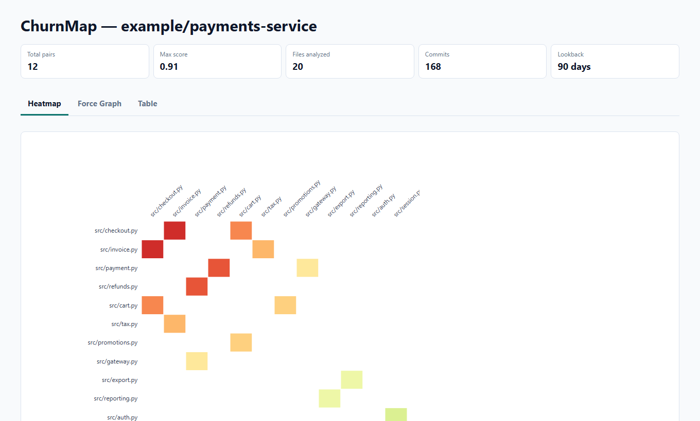

# churnmap

> See which files secretly change together before your refactor breaks them.

churnmap is an open-source change-coupling analyzer for git repositories. It turns commit history into an interactive D3 heatmap, force graph, and JSON report so maintainers can scope refactors, migrations, and architecture reviews from evidence instead of folklore.


One command, two durable artifacts. No signup, token, repository upload, hosted dashboard, or Kubernetes.

## What Is churnmap?

churnmap is a local git history analysis tool for finding change coupling: files that repeatedly appear in the same commits. It helps developers spot technical debt, refactoring risk, hidden ownership boundaries, and legacy-code hotspots before they start moving code.

## Why Developers Star It

- Finds hidden file coupling before a rewrite turns into a month-long chase.
- Gives refactor planning a visual artifact people can argue with.
- Produces static HTML and JSON, so the evidence survives after the meeting.
- Keeps source code and git history local.

## Install

```bash
pip install churnmap
```

Or with [uv](https://github.com/astral-sh/uv):

```bash
uv tool install churnmap
```

## Quick Start

```bash
# Analyze the current repository
churnmap

# Tune the analysis and open the report
churnmap \
  --repo /path/to/repo \
  --output-dir ./coupling-report \
  --lookback-days 180 \
  --min-occurrences 5 \
  --heatmap-limit 30 \
  --format both \
  --open
```

churnmap writes:

```text
coupling-report/
├── index.html     # Interactive Heatmap, Force Graph, and Table views
└── report.json    # Machine-readable meta + pairs envelope
```

## What You Get



- **Heatmap**: top files by maximum coupling score, with hotter cells showing stronger co-change relationships.
- **Force Graph**: file relationships where node size follows churn, node color follows risk, and edge thickness follows score.
- **Table**: the highest-risk pairs sorted by coupling score for quick review.
- **JSON**: the same signal in a script-friendly envelope for automation and dashboards.

## When To Use It

- When a refactor feels risky but nobody can name the blast radius.
- Before splitting a module, package, service, or bounded context.
- Before a rewrite, migration, or large dependency upgrade.
- When architecture diagrams disagree with commit history.
- When onboarding engineers need to see the real change paths, not just the folder tree.
- When you want CodeScene-style coupling signal without sending code or git history to a service.

## Flags

| Flag | Type | Default | Description |
|------|------|---------|-------------|
| `--repo` | `Path` | `.` | Path to git repository root |
| `--output-dir` | `Path` | `./coupling-report` | Output directory for report files |
| `--lookback-days` | `int` | `90` | Days of git history to analyze |
| `--min-occurrences` | `int` | `3` | Minimum co-change count to include a pair |
| `--heatmap-limit` | `int` | `50` | Max files in heatmap, ranked by max coupling score |
| `--top-files` | `int` | `100` | Max pairs shown in the HTML table |
| `--format` | `str` | `both` | Output format: `both`, `html`, or `json` |
| `--exclude` | `list[str]` | `[]` | Glob patterns to exclude; repeatable |
| `--low-threshold` | `float` | `0.3` | Score below this is low risk |
| `--high-threshold` | `float` | `0.7` | Score at or above this is high risk |
| `--open` | `bool` | `False` | Open HTML report in the browser after generation |
| `--version` | flag | - | Print version and exit |

## Config File

Drop a `.churnmap.yml` in your repo root to set defaults:

```yaml
lookback_days: 90
min_occurrences: 3
heatmap_limit: 50
top_files: 100
format: both
low_threshold: 0.3
high_threshold: 0.7
open: false
exclude:
  - "docs/**"
  - "*.md"
  - "migrations/**"
```

CLI flags override config file values.

## JSON Shape

```json
{
  "meta": {
    "repo": "example/payments-service",
    "generated_at": "2026-05-28",
    "lookback_days": 90,
    "total_commits_analyzed": 168,
    "churnmap_version": "1.0.0"
  },
  "pairs": [
    {
      "file_a": "src/checkout.py",
      "file_b": "src/invoice.py",
      "score": 0.91,
      "co_changes": 38,
      "total_commits": 42,
      "risk": "high"
    }
  ]
}
```

## Demo Kit

- [Product demo MP4](docs/assets/churnmap-demo.mp4)
- [README GIF](docs/assets/churnmap-demo.gif)
- [Interactive sample report](docs/demo/sample-report.html)
- [Sample JSON report](docs/demo/sample-report.json)

Regenerate the sample report:

```bash
PYTHONPATH=src python docs/demo/generate_sample_report.py
```

## How It Works

1. `coupling-core` parses git history, builds a co-change matrix, normalizes scores, and returns a `RepoAnalysis`.
2. `DataPreparer` turns the analysis into heatmap data, force-graph nodes and links, and sorted table pairs.
3. `HtmlRenderer` renders a Jinja2 template with embedded JSON data and D3 loaded from CDN.
4. `JsonWriter` emits the machine-readable report envelope.
5. `OutputWriter` writes the selected artifacts and optionally opens the HTML report.

## Used Alongside

- [couplingguard](https://github.com/Meru143/couplingguard) - PR-time coupling warnings as a GitHub Action. Same `coupling-core` engine, complementary surface.

## License

[MIT](LICENSE)
